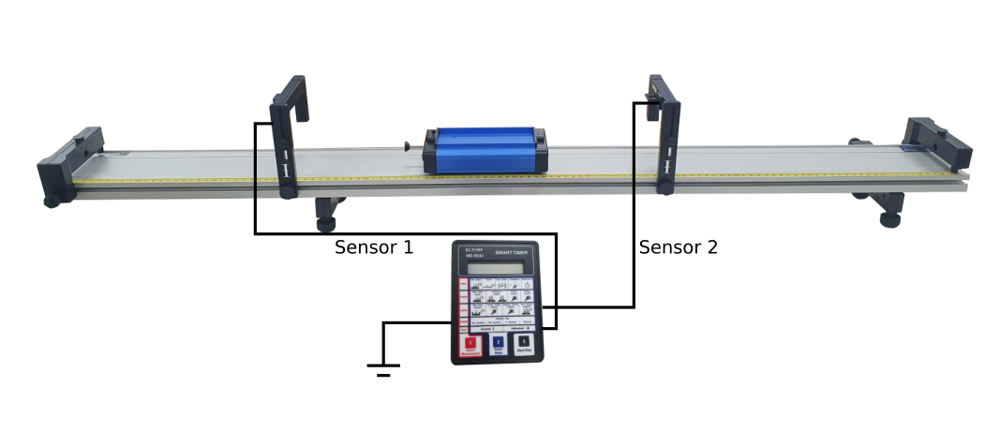
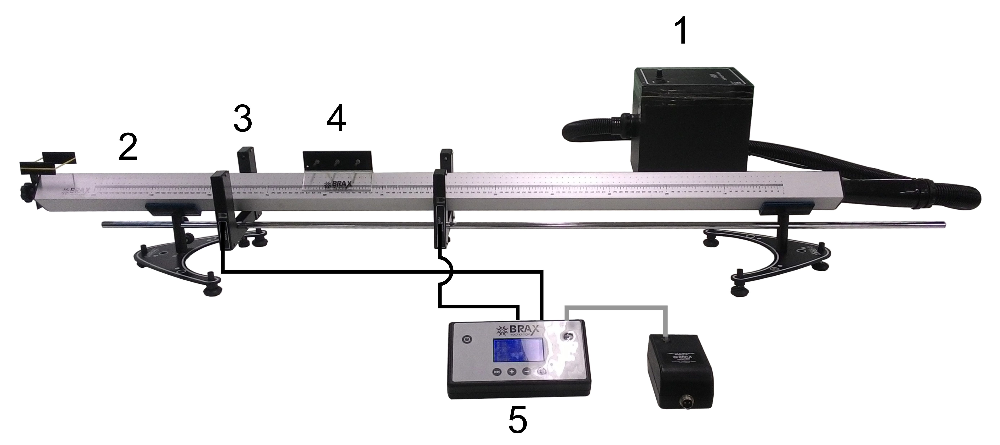

::: {.content-visible when-format="html"}
## Introdução

O **Movimento Retilíneo e Uniforme (MRU)** é aquele em que o vetor velocidade permanece constante ao longo do tempo. Assim, o móvel percorre uma trajetória retilínea com velocidade de módulo, direção e sentido constantes. Na Mecânica Clássica, essa condição está associada a uma força resultante nula atuando sobre o móvel, de acordo com a primeira Lei de Newton @Halliday1.

Considerando um móvel que se desloca com velocidade constante ($v$), sua velocidade pode ser expressa pela razão entre o deslocamento e o intervalo de tempo:

$$
  \begin{align*}
    v & = \dfrac{s - s_0}{t - t_0}
  \end{align*}
$$

Adotando ($t_0=0$), obtém-se a **função horária da posição**:

$$
  s = s_0 + vt
$${#eq-funcao-horaria-mru}

A @eq-funcao-horaria-mru mostra que, no MRU, a posição varia linearmente com o tempo. Dessa forma, a representação gráfica de (s) em função de (t) é uma reta, cujo coeficiente angular corresponde à velocidade do móvel.

Neste experimento, serão realizadas medidas de posição e tempo durante o movimento de um móvel, com o objetivo de verificar experimentalmente a relação entre essas grandezas e determinar a velocidade a partir da análise dos dados e do gráfico ($s \times t$).


<!-- ::: {.content-visible when-format="html"}
Por exemplo, a @fig-labfis-logo mostra o logo do Laboratório de Física.

{#fig-labfis-logo width=50%}

<div style="text-align: center; font-size: smaller;">
  **Fonte:** Labfis (2026)
</div>
::: -->

## Objetivos


1. Reconhecer o movimento retilíneo e uniforme
2. Construir o gráfico da variação da posição do móvel em função do tempo;
3. Obter o valor da velocidade do móvel a partir do gráfico $s$ versus $t$.

## Material necessário

::: {.callout-note}
O experimento possui duas configurações independentes: **Trilho de Rolamento** ou **Trilho de Ar**. Cada versão utiliza exclusivamente os materiais correspondentes à sua configuração.
:::


::: {.panel-tabset}

### Configuração com Trilho de Rolamento

::: {#fig-trilho-de-rolamento}
{}

<div style="text-align: center; font-size: smaller;">
  **Fonte:** Labfis (2026)
</div>
:::

 - 01 trilho de rolamento dotado de escala milimetrada;
 - 02 sensores fotoelétricos com múltiplas esperas de posicionamento;
 - 01 carro;
 - 01 cronômetro digital.

### Configuração com Trilho de Ar

::: {#fig-trilho-de-ar}
{}

<div style="text-align: center; font-size: smaller;">
  **Fonte:** Labfis (2026)
</div>
:::

  - 01 unidade geradora de fluxo de ar com mangueira de conexões rápidas (1);
  - 01 trilho de ar com barramento principal dotado de escala milimetrada, hastes paralelas, base secundária, com articulador dianteiro (2);
  - 02 sensores fotoelétricos com múltiplas esperas de posicionamento (3);
  - um carro com suporte (4);
  - um cronômetro digital (5).

:::

- Balança;
- Cronômetro;
- Paquímetro;
- Trilho de baixo atrito.

## Referências

:::{#refs}
:::
::::


```{=typst}
#show bibliography: it => {
  show heading: none
  it
}

= Introdução

Apresente brevemente os conceitos físicos relacionados à atividade, destacando os princípios e fenômenos que serão investigados. Contextualize o experimento e sua relevância para a compreensão do conteúdo, podendo incluir as principais equações ou relações teóricas necessárias à análise dos resultados. O parágrafo seguinte mostra um exemplo.

Conforme #cite(<Halliday1>, form: "prose"), *energia cinética* é a energia associada ao movimento de um corpo. Quando uma força resultante realiza trabalho sobre um corpo, sua velocidade pode ser alterada e, consequentemente, sua energia cinética também se modifica. Essa relação é expressa pelo teorema trabalho–energia cinética, segundo o qual o trabalho realizado pela força resultante sobre um corpo é igual à variação de sua energia cinética. Para um corpo de massa ($m$) que se move com velocidade ($v$), a energia cinética é dada por

$
K = 1/2 m v^2
$

Utilize imagens para complementar a explicação dos conceitos e procedimentos, priorizando esquemas, diagramas e fotografias que facilitem a compreensão do experimento. Toda imagem deve apresentar legenda e, quando necessário, identificar seus principais elementos. No texto, referencie a imagem utilizada. 


Por exemplo, a @fig-labfis-logo mostra o logo do Laboratório de Física.

#figure(
  image("assets/images/labfis-logo-transparente.png", width: 50%),
  caption: [Logo do Labfis]
)<fig-labfis-logo>

= Objetivos

Apresente de forma clara e objetiva o que se pretende alcançar com a atividade experimental, utilizando verbos de ação como

1. Investigar
2. Analisar
3. Determinar
4. Verificar
5. Compreender

= Material necessário

Liste todos os materiais, equipamentos e instrumentos que serão utilizados na atividade experimental, de forma organizada e objetiva.

- Balança;
- Cronômetro;
- Paquímetro;
- Trilho de baixo atrito.


#pagebreak()

= Procedimentos

Descreva, em ordem lógica e de forma clara e objetiva, as etapas necessárias para a realização do experimento, incluindo a montagem, as medições e os cuidados relevantes durante a execução. Sempre que póssível, inclua uma tabela de coleta de dados, como a @tab-coleta-dados.

#figure(
  kind: table,
  caption: [Coleta de dados],
)[
  #table(
    columns: (1fr, 1fr, 1fr),
    table.header([Coluna1], [Coluna2], [Coluna3]),
    [1], [], [],
    [2], [], [],
    [3], [], [],
    [4], [], [],
    table.cell(colspan: 2)[*Média*]
  )
]<tab-coleta-dados>

== Primeira parte

1. Passo 1
2. Passo 2
3. Passo 3
4. Passo 4

== Segunda parte

1. Passo 1
2. Passo 2
3. Passo 3
4. Passo 4
5. Passo 5


= Resultados

Apresente e organize os dados obtidos no experimento, utilizando tabelas, gráficos, cálculos e outras formas de representação que permitam analisar e interpretar os resultados.

#set heading(numbering: none)
= Referências

#bibliography("assets/references/references.bib", style: "assets/references/abnt.csl", title: none)
```